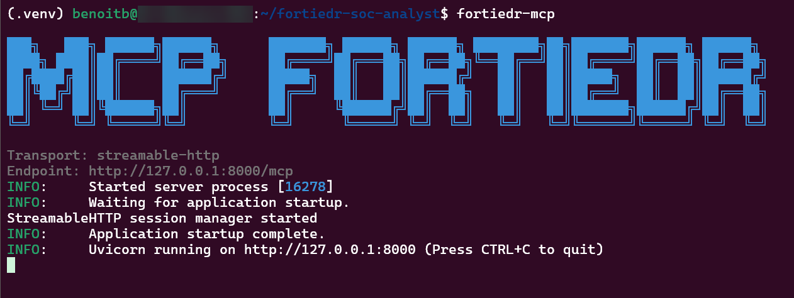
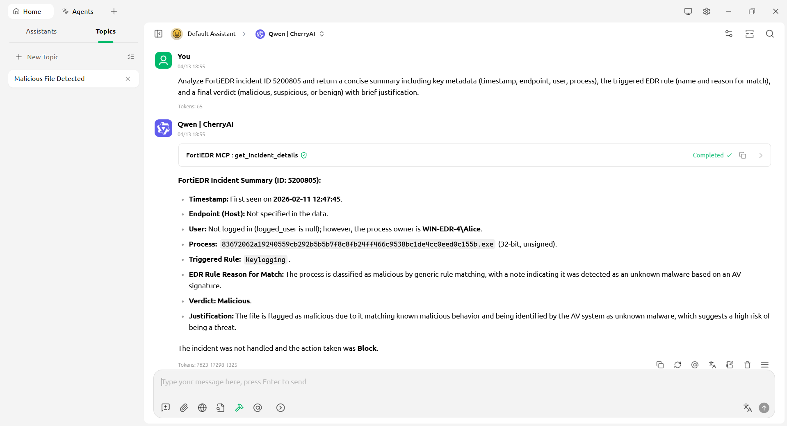
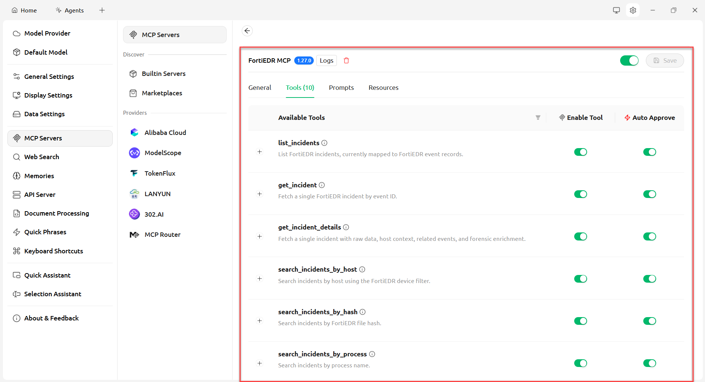
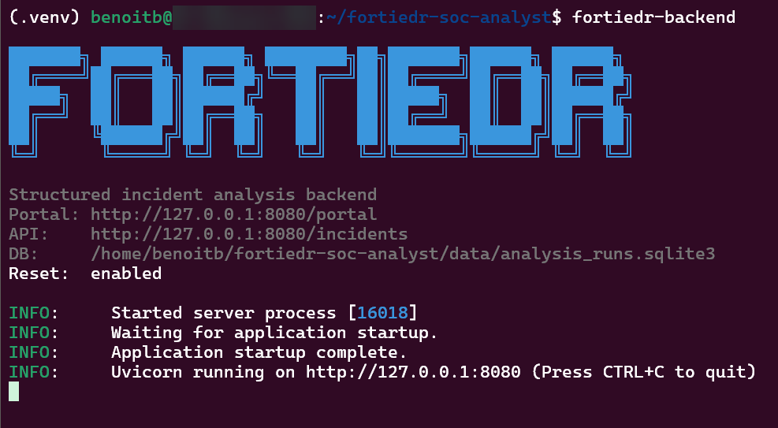
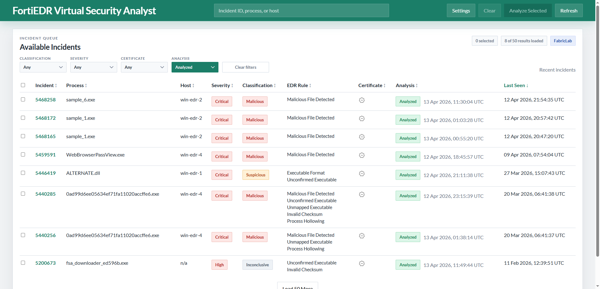
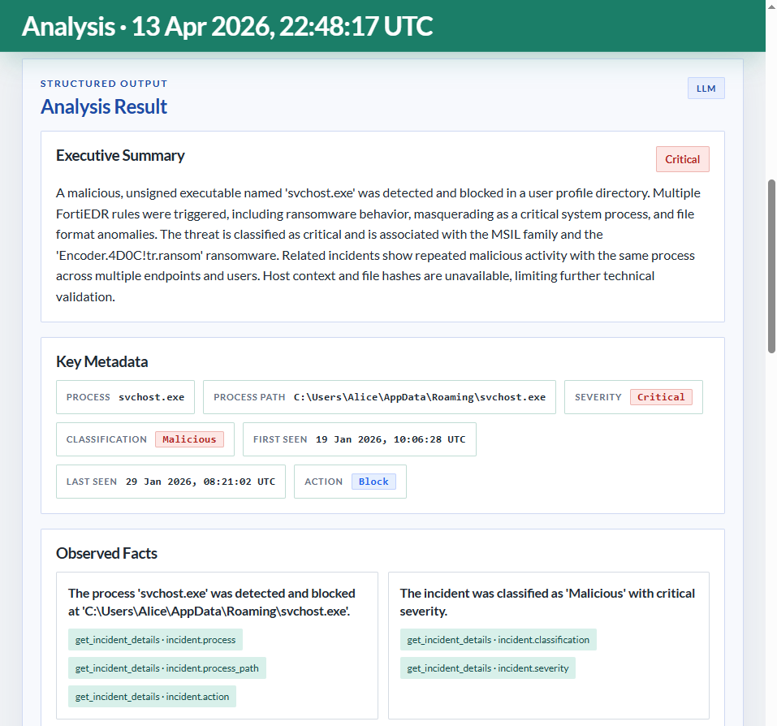

# FortiEDR SOC Analyst

`FortiEDR SOC Analyst` helps you use AI to analyze FortiEDR incidents.

You can use it in two ways:

- through an AI client connected to the read-only MCP server, so the model can retrieve FortiEDR incident and host data
- through the web portal and backend, so you can review incidents and run structured AI-assisted analysis in the browser

## Installation 🚀

```bash
git clone https://github.com/benoitbMTL/fortiedr-soc-analyst.git
cd fortiedr-soc-analyst
python3 -m venv .venv
source .venv/bin/activate
pip install -e .
```

Create a `.env` file in the project root and set your FortiEDR credentials:

```env
FORTIEDR_HOST=https://your-fortiedr-host
FORTIEDR_ORG=your-org
FORTIEDR_USER=your-user
FORTIEDR_PASS=your-password
```

Public LLM settings:

```env
OPENAI_API_KEY=...
OPENAI_MODEL=gpt-5.4-mini
ANTHROPIC_API_KEY=...
ANTHROPIC_MODEL=claude-3-5-sonnet-latest
```

Private LLM settings (Ollama):

```env
FORTIEDR_LLM_SERVER_PROVIDER=ollama
FORTIEDR_LLM_SERVER_URL=http://127.0.0.1:11434
OLLAMA_MODEL=qwen2.5:7b
```

## MCP Server 🔌

Start the MCP server:

```bash
fortiedr-mcp
```

Or run it directly with Python:

```bash
python -m fortiedr_mcp.server
```

Default MCP endpoint:

```text
http://127.0.0.1:8000/mcp
```





To use `stdio` transport instead of HTTP:

```bash
fortiedr-mcp --transport stdio
```

Main exposed tools:

- `list_incidents`
- `get_incident`
- `get_incident_details`
- `search_incidents_by_host`
- `search_incidents_by_hash`
- `search_incidents_by_process`
- `search_incidents_by_user`
- `get_host_context`
- `get_related_events`
- `get_forensics_events`



## Portail 🖥️

Start the backend server that also serves the portal:

```bash
fortiedr-backend
```

Or with explicit host, port, and database path:

```bash
fortiedr-backend --host 127.0.0.1 --port 8080 --db-path ./data/analysis_runs.sqlite3
```



Open the portal in Chrome:

```text
http://127.0.0.1:8080/portal
```





What the portal lets you do:

- browse incidents
- open one incident in detail
- launch an analysis run
- force a fresh run without cache reuse
- review the latest validated result
- inspect analysis history
- open one stored run with normalized input and raw LLM output
- submit analyst feedback

Useful backend endpoints:

```text
GET  /incidents
GET  /incidents/{id}
POST /incidents/{id}/analyze
GET  /incidents/{id}/analysis/latest
GET  /incidents/{id}/analysis/history
GET  /analysis/runs/{run_id}
POST /analysis/runs/{run_id}/feedback
```

Example: start one analysis run from the command line:

```bash
curl -X POST http://127.0.0.1:8080/incidents/5440222/analyze \
  -H 'content-type: application/json' \
  -d '{"force": false}'
```

## Notes

- The FortiEDR integration is read-only.
- The portal is a lightweight analyst UI, not a production frontend.
- Small local LLMs may fail on strict structured output; public LLMs or stronger local GPU-backed models work better for analysis.
- For the best experience, start with the portal and keep the MCP server for integrations and tooling. 🙂
